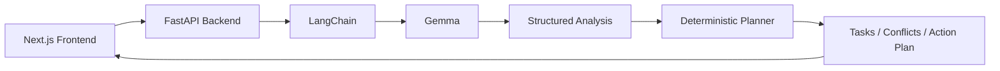

# LifeOS

Live URL: https://life-os-one-amber.vercel.app/

> **Your life is messy. Your plan doesn't have to be.**
>
> A multimodal AI life-admin assistant that turns scattered screenshots into an
> actionable plan using Gemma.


Upload five screenshots — an assignment page, a group chat, an exam schedule, an
event invite, an interview email. LifeOS reads all five **together**, works out
what they mean in relation to each other, and hands back an ordered plan you can
act on today.

[](https://nextjs.org)
[](https://react.dev)
[](https://fastapi.tiangolo.com)
[](https://langchain.com)
[](https://python.org)

---

## The problem

Nobody's deadlines live in one place. An LMS says the report is due Oct 7 at
11:59 PM. A group chat says the model has to be trained before the report can be
written. A schedule PDF says the DBMS exam is Oct 9 at 10 AM. An invite says a
college fest runs Oct 7–8. An interview confirmation says Oct 8, 11 AM.

Each one is trivial. Together they are a genuine scheduling problem, and the
answer — *train the model Tuesday, because the report is due Wednesday and the
exam is Thursday* — is not in any single screenshot.

Most tools read one image at a time and hand you a list. A list is not a plan.

## Cross-image reasoning is the whole point

LifeOS sends **every selected image in a single multimodal request**. The model
sees the assignment page, the chat, the schedule, the invite, and the email at
the same time, in one shared context, and reasons across them:

```text
Multiple screenshots
        ↓
     Gemma
        ↓
Cross-document understanding
        ↓
Tasks / Deadlines / Events / Dependencies
        ↓
Conflict detection
        ↓
Prioritized action plan
        ↓
Grounded chat
```

From the five sample screenshots, LifeOS derives:

| Source | Extracted |
| --- | --- |
| Assignment page | Report due **Oct 7, 11:59 PM** |
| Group chat | Model training must finish **before** the report → Oct 6 |
| Exam schedule | DBMS exam **Oct 9, 10 AM** |
| College invite | Fest runs **Oct 7–8** |
| Interview email | Interview **Oct 8, 11 AM** |

It does not just collect these. It notices the fest **collides** with the report
deadline, that the interview sits the morning after a deadline, and that model
training is a **dependency** of the report rather than an independent task. That
ordering is the product.

Then, when you ask *"Why did you tell me to finish model training first?"*, the
answer is grounded in the relationship between the group message, the assignment
deadline, and the required evaluation work — not generated from scratch.

## Demo

<!-- TODO: replace the placeholders below with real links before submitting. -->

| | |
| --- | --- |
| **Live demo** | https://life-os-one-amber.vercel.app/ |
| **Demo video** | _add URL_ |
| **Screenshots** | _see `demo/`_ |

**Walkthrough**

1. Drop in the five sample screenshots.
2. Hit **Read 5 frames**. One request, one pass over all of them.
3. Read the summary, then the circled conflicts.
4. Read **The order** — the prioritized plan.
5. Click any item's frame number to open the screenshot it was read from and
   check the extraction yourself.
6. Ask: *"What should I do first?"*, *"Where am I double-booked?"*

Sample input for the demo:

```text
Assignment → Oct 7, 11:59 PM
Model training → Oct 6 dependency
Interview → Oct 8, 11 AM
DBMS exam → Oct 9, 10 AM
College event → Oct 7–8
```

## Why Gemma?

Gemma is not a summarizer bolted onto the end of a pipeline. It is doing the
work that cannot be precomputed.

- **Multimodal understanding** — it reads screenshots, which is the only input
  format this product accepts. There is no API, no export, no integration.
- **Cross-document reasoning** — the group message says "model must be ready
  before the report"; the assignment says the report is due Oct 7. Connecting
  those two is inference across documents, not extraction from one.
- **Structured extraction** — output is validated Pydantic, so a malformed
  response can never reach the interface.
- **Grounded follow-up questions** — chat runs as a second model call over the
  *extracted facts*, never the raw images, so answers stay consistent with the
  plan already on screen.

And critically: **the model extracts facts, but never decides the plan.** See
[Deterministic planning](#why-planning-is-not-a-model-call).

## Architecture



**Frontend** — drag-and-drop upload, numbered frame previews, staged progress
while analyzing, the results sheet, and grounded chat.

**FastAPI** — validates uploads (count, type, size) before spending a model
call, hosts `/api/analyze`, `/api/chat`, and `/api/calendar`.

**LangChain** — prompt construction, model invocation, structured output, and
retry orchestration. `llm.py` is the only module that constructs the model.

**Gemma** — multimodal understanding, extraction, and cross-document reasoning
across all images at once.

**Deterministic planner** — priority calculation, deadline ordering, and
conflict detection, in plain Python.

### Why planning is not a model call

This is the most important decision in the codebase.

If the model chose the order, it could confidently assert that a task due in
three weeks outranks one due tomorrow, or invent a deadline you never had. So
extraction and planning are deliberately split:

```text
Gemma    →  facts        (what the screenshots say)
Python   →  plan         (what to do, in what order)
```

`planner.py` contains **zero** model calls. It sorts by priority band, then
nearest deadline, then title for stable output. A priority the model stated can
be *raised* by the clock but never *lowered* by it.

Conflict detection is four deterministic rules: event/event time overlap, an
event landing on a deadline's day, two or more deadlines inside 24 hours, and a
task falling due after the deadline it feeds.

## How it works

1. User uploads multiple screenshots.
2. LifeOS validates them — count, MIME type, per-file size, total size.
3. All images are sent **together** to Gemma through LangChain, as one message.
4. Gemma extracts structured tasks, deadlines, events, and cross-image
   dependencies.
5. The planner identifies conflicts and computes priority in Python.
6. LifeOS returns a prioritized action plan, each item citing its source frame.
7. The user asks follow-up questions answered against the extracted context.

## Tech stack

| Layer | Technology |
| --- | --- |
| Frontend | Next.js 16, React 19, TypeScript, Tailwind CSS 4 |
| Backend | Python 3.11+, FastAPI, Uvicorn |
| AI | Gemma via Gemini API |
| AI framework | LangChain |
| Validation | Pydantic 2 |
| Calendar export | RFC 5545 iCalendar (no third-party dependency) |

No database, no vector store, no background queue, no auth service — by design,
see [Limitations](#limitations).

## Quick start

### Prerequisites

- Node.js 22+ and pnpm
- Python 3.11+
- A Gemini API key — [get one here](https://aistudio.google.com/apikey)

### Backend

```bash
cd backend
python -m venv .venv
source .venv/bin/activate      # Windows: .venv\Scripts\activate
pip install -r requirements.txt
cp .env.example .env           # then add your key
uvicorn app.main:app --reload --port 8000
```

### Frontend

```bash
cd frontend
pnpm install
cp .env.example .env.local
pnpm dev
```

Open <http://localhost:3000>. API docs at <http://localhost:8000/docs>.

### Environment variables

```env
# backend/.env
GEMINI_API_KEY=                # required — server-side only, never commit
GEMMA_MODEL=                   # required — the model identifier
CORS_ORIGIN=http://localhost:3000
STRUCTURED_OUTPUT_METHOD=prompt_json

# frontend/.env.local
NEXT_PUBLIC_API_URL=http://localhost:8000
```

`GEMMA_MODEL` is the single source of truth for the model name; it appears
nowhere else in the codebase.

The browser never talks to Gemini. It calls FastAPI, and FastAPI is the only
caller of the Gemini API — there is no AI SDK in the frontend bundle and no key
in any client-side code.

## API

### `POST /api/analyze`

`multipart/form-data` with one or more `files[]` entries.

| | |
| --- | --- |
| Formats | PNG, JPEG, WEBP |
| Max images | 5 |
| Max size per image | 10 MB |
| Max request size | 30 MB |

```bash
curl -X POST localhost:8000/api/analyze \
  -F "files=@assignment.png" \
  -F "files=@groupchat.png" \
  -F "files=@schedule.png"
```

```json
{
  "success": true,
  "analysis": {
    "summary": "...",
    "tasks": [
      {
        "title": "Train the model",
        "description": "Required before the report can be written",
        "deadline": "2026-10-06",
        "priority": "high",
        "source": "groupchat.png"
      }
    ],
    "events": [],
    "deadlines": [],
    "conflicts": [],
    "plan": []
  }
}
```

Returns `400` for a rejected upload (before any model call) or `502` if the
model fails.

### `POST /api/chat`

```json
{
  "question": "Why did you tell me to finish model training first?",
  "context": { "tasks": [], "events": [], "deadlines": [], "conflicts": [], "plan": [] }
}
```

```json
{ "answer": "...", "sources": ["assignment.png", "groupchat.png"] }
```

The model receives the structured context, never the images.

### `GET /api/calendar`

Exports dated events as an `.ics` file you can import into Google, Apple, or
Outlook Calendar. No OAuth, and nothing is sent to a third party.

### `GET /api/health`

Reports the loaded model and upload limits. Never returns the API key.

## Example

```text
INPUT
5 screenshots:
- assignment
- group chat
- exam schedule
- event invitation
- interview email

↓

ANALYSIS
Tasks          train the model, submit the report, attend the exam
Deadlines      report due Oct 7 23:59, exam Oct 9 10:00
Events         interview Oct 8 11:00, fest Oct 7–8
Dependencies   model training → report submission
Conflicts      fest overlaps the report deadline

↓

OUTPUT
Prioritized action plan:
1. Train the model (Oct 6) — dependency of the report
2. Submit the report (Oct 7) — fest runs the same day
3. Interview (Oct 8)
4. DBMS exam (Oct 9)
```

Ask it: **"Why did you tell me to finish model training first?"**

The answer is grounded in the relationship between the group message (the model
must be ready), the assignment deadline (the report is due Oct 7), and the
required evaluation work — not invented at answer time.

## Project structure

```text
hacktoberfest-2026/
├── backend/
│   ├── app/
│   │   ├── main.py          FastAPI app, CORS, Swagger
│   │   ├── config.py        Settings; sole reader of GEMMA_MODEL
│   │   ├── schemas.py       Pydantic contracts
│   │   ├── prompts.py       Prompt text
│   │   ├── llm.py           The only place the model is constructed
│   │   ├── planner.py       Deterministic priority + conflicts, no LLM
│   │   ├── calendar.py      RFC 5545 export
│   │   ├── uploads.py       Upload validation
│   │   └── routers/         analyze.py, chat.py, calendar.py
│   └── requirements.txt
├── frontend/
│   └── src/
│       ├── app/             App Router entry, layout, design tokens
│       ├── components/      UploadZone, ImagePreview, AnalysisProgress,
│       │                    Rows, SourcePreview, ChatPanel, CalendarExport
│       └── lib/             types.ts, api.ts, utils.ts
├── docs/
│   ├── README.md            Documentation index
│   ├── ARCHITECTURE.md      Why the boundaries sit where they do
│   ├── GETTING_STARTED.md   File-by-file tour
│   └── DEVELOPMENT.md       Workflow, checks, known traps
├── SPEC.md                  The engineering contract
└── README.md
```

## Limitations

Stated plainly, because they matter when judging the project.

- **No persistent database.** State lives in React and the current request. A
  page refresh clears the session. Adding storage would mean a schema and an
  upload lifecycle for a tool whose input is a temporary pile of screenshots.
- **Current-session chat only.** Chat reasons over the analysis in front of you.
  There is no memory across analyses.
- **Image-based input only.** No PDF, email, or calendar-API ingestion.
- **Relative dates are not resolved.** If a screenshot says *"submissions start
  tomorrow"*, the model records the event without resolving it to a date, because
  doing so would mean inventing information the screenshot never contained. Such
  events are excluded from calendar export, and the UI says which ones.
- **Conflicts are what the rules and the model can see.** They are a strong
  signal, not a substitute for reading your own schedule.
- **Calendar export is a file, not a sync.** Events are not written back to a
  live Google Calendar; OAuth and token storage were out of scope.
- **Unverified against the live model.** The integration is built against the
  installed LangChain version, but the end-to-end path needs a real API key to
  confirm.

## Hackathon alignment

### Best use of open models

LifeOS uses open-weight Gemma as a core functional component, not decoration.
Multiple images are analysed together to understand relationships between
otherwise disconnected pieces of information — the group message, the
assignment, and the schedule become one coherent plan only because the model
reads them in a shared context.

Structured output is validated with Pydantic, and the plan is computed
deterministically, which keeps the system reliable rather than merely
impressive.

### Best open-source AI project

Published as an open-source project. The architecture is deliberately legible:
one module owns the model, one owns planning, and neither leaks into the other.

## Open source

<!-- TODO: add a LICENSE file before submitting, then replace this section. -->

This repository currently has **no license file**. Until one is added, the
default copyright applies and the project is not formally open source — add an
Apache-2.0 `LICENSE` to make it so.

Note that this project's license covers **this source code only**. It does not
relicense Gemma or the Gemini API service. Model weights remain under Google's
terms, and use of the Gemini API is governed by the
[Google APIs Terms of Service](https://policies.google.com/terms) and its
acceptable-use policy.

## Documentation

| Document | Read it for |
| --- | --- |
| [`SPEC.md`](SPEC.md) | The engineering contract this implements |
| [`docs/ARCHITECTURE.md`](docs/ARCHITECTURE.md) | Why the boundaries sit where they do |
| [`docs/GETTING_STARTED.md`](docs/GETTING_STARTED.md) | File-by-file tour and invariants |
| [`docs/DEVELOPMENT.md`](docs/DEVELOPMENT.md) | Workflow, checks, and known traps |

## Acknowledgements

Built for **Hacktoberfest Hack Day Surat 2026**. Uses
[LangChain](https://langchain.com), [Gemma](https://ai.google.dev/gemma) via the
Gemini API, [FastAPI](https://fastapi.tiangolo.com), and
[Next.js](https://nextjs.org).

---

Deliberately out: database, RAG or embeddings, multi-agent orchestration,
background queues, LangSmith, LangGraph. Planning and conflict detection are
plain Python. [`SPEC.md`](SPEC.md) is the contract this implementation follows.
